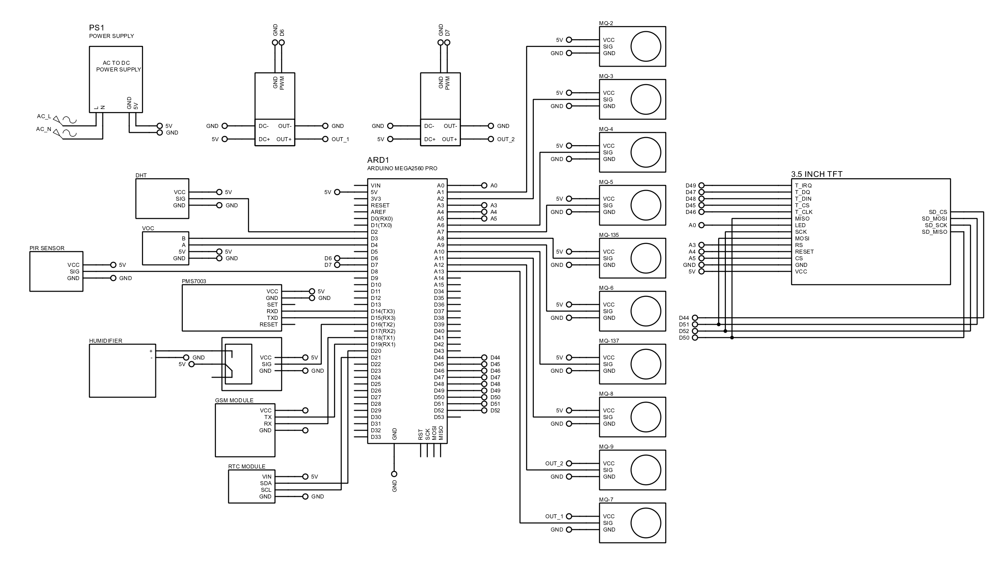

# Smart Air Quality Monitoring and Fragrance Control System

This project is an Arduino Mega-based **advanced air quality monitoring system** that detects multiple gases, particulate matter, and environmental conditions in real time. It also includes an **automatic fragrance (misting) system**, **data logging**, **visual display**, and **SMS alert notifications**.

The system is designed for environments such as **bathrooms, indoor spaces, and industrial areas** where air quality monitoring and odor control are important.

---

## Project Overview

The system integrates:

- Multiple **MQ gas sensors**  
- **PMS7003 particulate sensor**  
- **DHT11 temperature and humidity sensor**  
- **VOC detection (digital classification)**  
- **PIR sensor (human presence detection)**  
- **Fragrance misting system**  
- **TFT LCD display (ILI9488)**  
- **RTC (Real-Time Clock)**  
- **SD card logging system**  
- **GSM module for SMS alerts**  

It automatically:
- monitors air quality  
- detects pollution levels  
- activates misting system when needed  
- logs data for analysis  
- alerts users via SMS  

---

## Features

### 🧪 Multi-Gas Detection

Supports multiple MQ sensors:

| Sensor   | Gas Detected                |
|----------|----------------------------|
| MQ2      | LPG, Smoke                 |
| MQ3      | Alcohol                    |
| MQ4      | Methane                    |
| MQ5      | Natural Gas                |
| MQ6      | LPG                        |
| MQ7      | Carbon Monoxide (CO)       |
| MQ8      | Hydrogen                   |
| MQ9      | CO, Methane                |
| MQ135    | Air Quality (CO₂, NH₃)     |
| MQ137    | Ammonia (NH₃)              |

---

### 🌫️ Particulate Matter Monitoring (PMS7003)

- Measures:
  - PM1.0  
  - PM2.5  
  - PM10  
- Provides real-time dust concentration  

---

### 🌡️ Temperature & Humidity Monitoring

- Uses **DHT11 sensor**
- Displays:
  - temperature (°C)  
  - humidity (%)  

---

### 🧴 VOC Detection

- Classifies air quality:
  - Clean  
  - Slight Pollution  
  - Medium Pollution  
  - Heavy Pollution  

---

### 🌬️ Automatic Fragrance System

- Activates misting when:
  - gas levels exceed thresholds  
  - odor/pollution detected  
- Uses:
  - float sensor (detects empty liquid)  
  - PIR sensor (only activates when people are present)  

---

### 📺 TFT Display Interface

- Uses **ILI9488 LCD**
- Displays:
  - gas concentrations (PPM)  
  - particulate values  
  - VOC status  
  - temperature & humidity  
  - real-time clock  

---

### 📅 Real-Time Clock (RTC)

- Uses **DS3231**
- Displays:
  - date  
  - time  
- Used for:
  - timestamping logs  

---

### 💾 SD Card Data Logging

- Saves sensor data in CSV format  
- Organized by:
  - year/month/day/hour  

Example data:
MQ2, MQ3, MQ4, MQ5, MQ6, MQ7, MQ8, MQ9, MQ135, MQ137, VOC, PM1.0, PM2.5, PM10, TEMP, HUMID

---

### 📡 GSM Alert System

- Sends SMS alerts when:
  - air quality becomes unsafe  
  - fragrance tank is empty  

---

## System Workflow

### 1. Initialization
- Initializes sensors, LCD, RTC, SD card, GSM  
- Calibrates gas sensors (preset R0 values)  

---

### 2. Continuous Monitoring
- Reads:
  - MQ sensors  
  - PMS7003  
  - DHT11  
  - VOC pins  
  - PIR sensor  

---

### 3. Air Quality Analysis
- Compares values with thresholds  
- Identifies unsafe conditions  

---

### 4. Action System

#### If pollution detected:
- Activates **misting system**  
- Sends **SMS alert**  

#### If tank empty:
- Sends refill notification  

---

### 5. Display Output
- Shows:
  - real-time sensor data  
  - warnings  
  - system status  

---

### 6. Data Logging
- Saves readings to SD card every 30 seconds  

---

## Pin Configuration

### Gas Sensors

| Sensor   | Pin |
|----------|-----|
| MQ2      | A1  |
| MQ3      | A2  |
| MQ4      | A6  |
| MQ5      | A7  |
| MQ135    | A8  |
| MQ6      | A9  |
| MQ137    | A10 |
| MQ8      | A11 |
| MQ9      | A12 |
| MQ7      | A13 |

---

### Other Sensors

| Component        | Pin |
|------------------|-----|
| DHT11            | 2   |
| Float Sensor     | 3   |
| PIR Sensor       | 8   |
| VOC Pins         | A14, A15 |

---

### Actuators

| Component        | Pin |
|------------------|-----|
| Misting System   | 22  |

---

### Communication

| Device       | Serial |
|--------------|--------|
| GSM Module   | Serial1 |
| PMS7003      | Serial3 |
| Debug        | Serial  |

---

### Voltage Control

| Function        | Pin |
|----------------|-----|
| MQ7 Voltage    | 6   |
| MQ9 Voltage    | 7   |

---

### SD Card

| Component | Pin |
|----------|-----|
| CS       | 44  |

---

## Hardware Components

- Arduino Mega 2560  
- MQ Gas Sensors (MQ2–MQ9, MQ135, MQ137)  
- PMS7003 Dust Sensor  
- DHT11 Sensor  
- PIR Motion Sensor  
- Float Sensor  
- GSM Module (SIM800/900)  
- ILI9488 TFT LCD  
- DS3231 RTC Module  
- SD Card Module  
- Relay / Misting Device  

---

## Code Reference

📄 Source code:  
:contentReference[oaicite:0]{index=0}  

---

## Notes

- MQ sensors require warm-up time  
- R0 calibration values are pre-configured  
- MQ7 and MQ9 use alternating voltage cycles (5V / high voltage)  
- Misting activates only when:
  - pollution detected  
  - people present (PIR)  
  - liquid available  

---

## Limitations

- No cloud integration  
- Threshold-based detection (no AI)  
- Requires stable power supply  
- Sensor calibration may vary by environment  

---

## Summary

This project demonstrates a **complete smart environmental monitoring system** combining:

- multi-gas detection  
- particulate monitoring  
- environmental sensing  
- automated odor control  
- real-time display  
- data logging  
- SMS alerts  

It is suitable for:

- smart bathrooms  
- indoor air quality monitoring  
- industrial safety systems  
- environmental research

